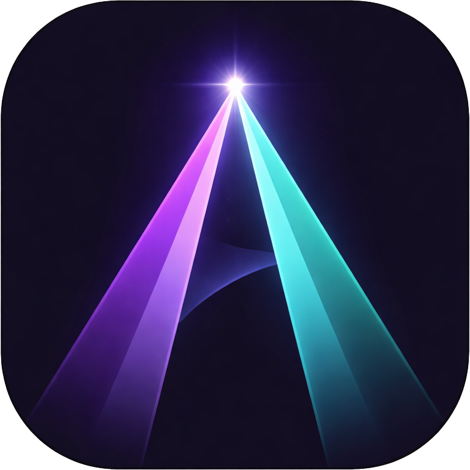
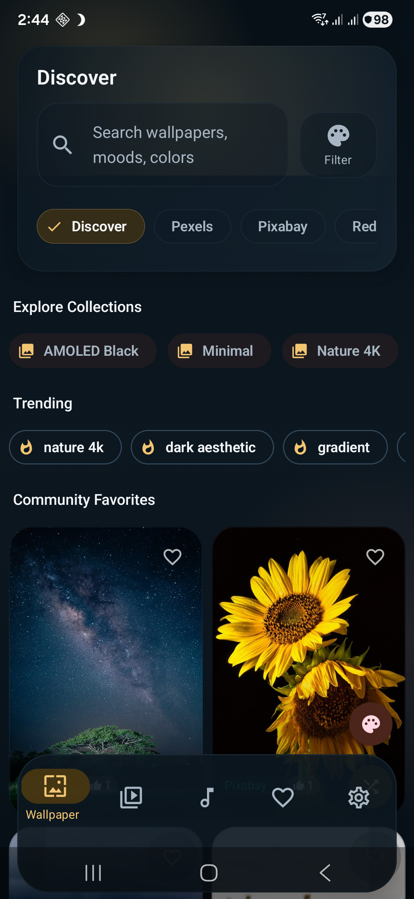

<p align="center">
  
</p>

<h1 align="center">Aura</h1>


> Open-source alternative to Zedge — wallpapers, video wallpapers, ringtones, and sounds for Android. **YouTube integration, yt-dlp powered.**



## What Makes Aura Different

- **YouTube-powered sounds** — search YouTube for ringtones, notifications, and alarms. NewPipe Extractor for search, yt-dlp for stream extraction.
- **Video wallpapers from YouTube** — browse, preview with ExoPlayer auto-play, crop landscape to portrait, apply as live wallpaper.
- **20+ content sources** — Wallhaven, Pexels, Pixabay, Reddit, YouTube, Freesound, Openverse, SoundCloud, and community uploads.
- **Instant startup** — Discover feed is cached locally. On subsequent launches wallpapers appear immediately while fresh results load in the background.
- **5 bottom nav tabs** — Wallpapers, Videos, Sounds, Favorites, Settings.

## Quick Start

```bash
git clone https://github.com/SysAdminDoc/Aura.git
cd Aura
```

Open in Android Studio and run. Everything works out of the box.

## Features

| Feature | Description |
|---------|-------------|
| **HD/4K Wallpapers** | Discover feed from Wallhaven, Pexels, Pixabay, Unsplash & Reddit |
| **Video Wallpapers** | Browse YouTube video wallpapers with ExoPlayer auto-preview |
| **Video Crop Editor** | Convert landscape videos to portrait with draggable 9:16 crop overlay |
| **Parallax Wallpapers** | ML Kit depth segmentation for layered tilt-responsive live wallpapers |
| **Weather Wallpapers** | Live weather effects overlay on wallpapers |
| **YouTube Sounds** | Search YouTube for ringtones, notifications, alarms — powered by yt-dlp |
| **Freesound + Openverse** | CC-licensed audio from Freesound v2 (primary) and Openverse (fallback, zero auth) |
| **SoundCloud** | CC-licensed tracks with optional client_id |
| **Community Uploads** | Upload and share sounds via Firebase Storage |
| **Sound Source Badges** | Color-coded source indicators on every sound card |
| **Real-Time Waveform** | Mini waveform on each sound card tracks actual playback position |
| **Configurable Search** | Customize YouTube search queries and blocked words per sound tab |
| **Ringtones & Sounds** | Tab-based browsing: Ringtones (8-30s), Notifications (0-5s), Alarms (5-40s) |
| **Sound Editor** | Waveform trim, fade in/out, normalize, format convert (MP3/OGG/WAV/FLAC/M4A) |
| **Wallpaper Editor** | Brightness, contrast, saturation, blur with 6 filter presets |
| **Crop & Position** | Pinch-zoom with aspect ratio presets (9:16, 16:9, 1:1) |
| **Collections** | Organize wallpapers into named folders with 2x2 cover previews |
| **Home Widget** | Glance-based widget for quick shuffle with error feedback |
| **Auto Wallpaper** | Rotation schedule + source selection including favorites |
| **Shuffle FAB** | One-tap random wallpaper from current tab |
| **Per-Contact Ringtones** | Assign custom ringtones to individual contacts |
| **Dual Wallpapers** | Coordinated home + lock screen wallpaper pairs |
| **Favorites Export** | JSON export/import with full metadata via Android SAF |
| **Community Voting** | Upvote/downvote wallpapers and sounds via Firebase |
| **OLED Dark Theme** | Deep blacks, zero burn-in, Material 3 |

## Content Sources

| Source | Content | Auth |
|--------|---------|------|
| [Wallhaven](https://wallhaven.cc) | 1M+ HD/4K wallpapers | None (optional key for NSFW) |
| [Pexels](https://pexels.com) | Curated HD photos + videos | Built-in key |
| [Pixabay](https://pixabay.com) | Editor's choice photos + videos | Built-in key |
| [Reddit](https://reddit.com) | 7 wallpaper + 4 video subreddits | None |
| [YouTube](https://youtube.com) | Video wallpapers + sounds via NewPipe + yt-dlp | None |
| [Freesound](https://freesound.org) | CC-licensed sound effects (v2 API) | Built-in key |
| [Openverse](https://openverse.org) | CC-licensed audio fallback | None |
| [SoundCloud](https://soundcloud.com) | CC-licensed tracks | Optional key |
| Firebase | Community uploads + voting | Built-in |

## Architecture

```
Jetpack Compose UI (16+ screens, 5 bottom nav tabs)
  Wallpapers | Videos | Sounds | Favorites | Settings
  Editors | Collections | Downloads | Onboarding | Widget
ViewModels (Hilt) + Cache Layer
  Repos: Wallhaven, Picsum, Pexels, Pixabay, Bing, Reddit, YouTube, Openverse, Freesound, Collections
  Services: WallpaperApplier, SoundApplier, VideoWallpaperService,
            ParallaxWallpaperService, WeatherWallpaperService, DualWallpaperService,
            DownloadManager, AudioTrimmer, BatchDownload,
            ContactRingtone, FavoritesExporter, OfflineFavorites
  YouTube: NewPipe Extractor (search) + yt-dlp (stream extraction + FFmpeg crop)
Room DB v9 (Favorites, Downloads, Search History, Wallpaper Cache,
            Wallpaper History, Collections)
DataStore (Settings, Onboarding)
Firebase RTDB (Community Voting + Uploads + Admin Moderation)
```

## Tech Stack

| Component | Library |
|-----------|---------|
| UI | Jetpack Compose + Material 3 |
| DI | Hilt 2.53.1 |
| Database | Room 2.6.1 |
| Network | Retrofit 2.11.0 + OkHttp |
| JSON | Moshi + KSP codegen |
| Images | Coil 2.7.0 |
| Audio/Video | Media3 ExoPlayer |
| ML | ML Kit Selfie Segmentation |
| YouTube Search | NewPipe Extractor |
| YouTube Streams | yt-dlp (youtubedl-android 0.18.1) |
| Scheduling | WorkManager 2.10.0 |
| Widget | Glance 1.1.1 |
| Min SDK | 26 (Android 8.0) |
| Target SDK | 35 (Android 15) |
| Kotlin | 2.1.0 |

## Building

Requires JDK 17+ and Android SDK 35. Android Studio Ladybug (2024.2.1) or later recommended.

```bash
./gradlew assembleDebug      # use gradlew.bat on Windows
./gradlew assembleRelease     # requires signing config
```

> Always use the included Gradle wrapper. It pins Gradle 8.12 which is required by AGP 8.7.3.

## Contributing

Issues and PRs welcome. Please follow existing code style (Kotlin, Compose, Hilt patterns).

## License

MIT License - see [LICENSE](LICENSE) for details.

Content from third-party sources retains its original license. YouTube content is accessed via NewPipe Extractor and yt-dlp under their respective open-source licenses.
